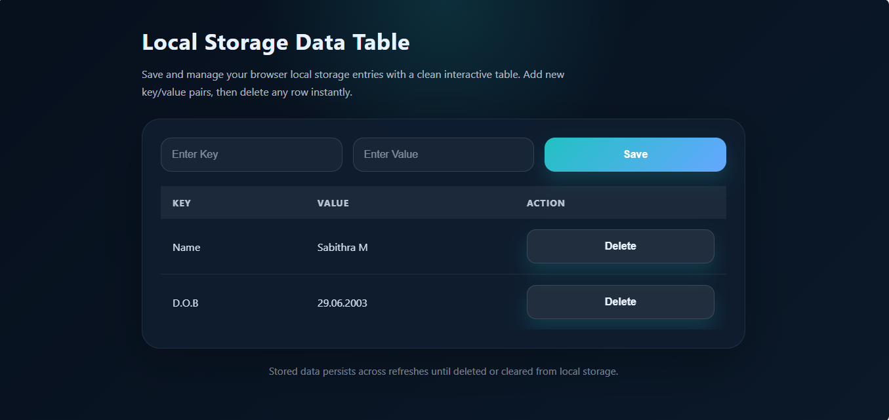

## 📊 Local Storage Table Manager

A simple and responsive web application that allows users to **add**, **display**, and **delete data** in a table format using browser Local Storage.

# 🚀 Features

- **Add data** using localStorage.setItem()
- **Retrive & display data** using localStorage.getItem()
- **Delete data** using localStorage.removeItem()
- **Persistent storage** (data remains after page refresh)
- **Responsive design** (works on mobile & desktop)

# Live Demo

[Visit Website](https://sabithra-m.github.io/Local-Storage-Table-Manager/)

# 📸 Preview

# 🛠️ Tech Stack

- 🌐 HTML
- 🎨 CSS
- ⚡ JavaScript

# ▶️ How to Run

1. Clone the repository
2. Open the project folder
3. Run **index.html** in your browser

# 📚 What I Learned

- 💡 Working with **Local Storage API**
- 🔄 Using **JSON.stringify() & JSON.parse()**
- 🧩 **DOM manipulation** and event handling
- 📱 Building **responsive web design**

# Future Improvements
- ✏️ Add **edit/update functionality**
- 🎯 Improve **UI/UX design**
- ✅ Add **form validation**

# 👩‍💻 Author
**Sabithra M**

*If you like this project, dont'forget to star the repository!*

